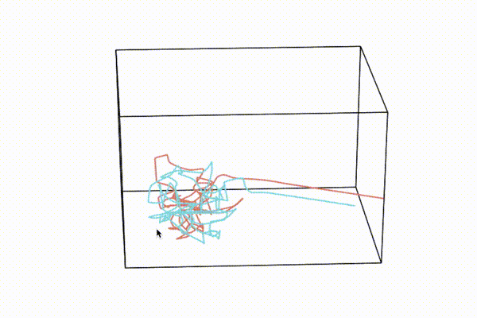

"_To deal with hyper-planes in a 14 dimensional space, visualize a 3D space and say 'fourteen' very loudly.  Everyone does it._" - Geoff Hinton


<h2>Overview</h2>

HyperTools is designed to facilitate
[dimensionality reduction](https://en.wikipedia.org/wiki/Dimensionality_reduction)-based
visual explorations of high-dimensional data.  The basic pipeline is
to feed in a high-dimensional dataset (or a series of high-dimensional
datasets) and, in a single function call, reduce the dimensionality of
the dataset(s) and create a plot.  The package is built atop many
familiar friends, including [matplotlib](https://matplotlib.org/),
[scikit-learn](http://scikit-learn.org/) and
[seaborn](https://seaborn.pydata.org/).  Our package was recently
featured on
[Kaggle's No Free Hunch blog](http://blog.kaggle.com/2017/04/10/exploring-the-structure-of-high-dimensional-data-with-hypertools-in-kaggle-kernels/).

<h2>Try it!</h2>

Click the badge to launch a binder instance with example uses:

[](http://mybinder.org:/repo/contextlab/hypertools-paper-notebooks)

or

Check the [repo](https://github.com/ContextLab/hypertools-paper-notebooks) of Jupyter notebooks from the HyperTools [paper](https://arxiv.org/abs/1701.08290).

<h2>Installation</h2>

To install the latest stable version run:

`pip install hypertools`

To install the latest unstable version directly from GitHub, run:

`pip install -U git+https://github.com/ContextLab/hypertools.git`

Or alternatively, clone the repository to your local machine:

`git clone https://github.com/ContextLab/hypertools.git`

Then, navigate to the folder and type:

`pip install -e .`

(These instructions assume that you have [pip](https://pip.pypa.io/en/stable/installing/) installed on your system)

<h2>Requirements</h2>

+ python 2.7, 3.4+
+ PPCA>=0.0.2
+ scikit-learn>=0.18.1
+ pandas>=0.18.0
+ seaborn>=0.7.1
+ matplotlib>=1.5.1
+ scipy>=0.17.1
+ numpy>=1.10.4
+ future
+ requests
+ pytest (for development)
+ ffmpeg (for saving animations)

If installing from github (instead of pip), you must also install the requirements:
`pip install -r requirements.txt`

<h2>Documentation</h2>

Check out our [readthedocs](http://hypertools.readthedocs.io/en/latest/) page for further documentation, complete API details, and additional examples.

<h2>Citing</h2>

We wrote a paper about HyperTools, which you can read [here](https://arxiv.org/abs/1701.08290). We also have a repo with example notebooks from the paper [here](https://github.com/ContextLab/hypertools-paper-notebooks).

Please cite as:

`Heusser AC, Ziman K, Owen LLW, Manning JR (2017) HyperTools: A Python toolbox for visualizing and manipulating high-dimensional data.  arXiv: 1701.08290`

Here is a bibtex formatted reference:

```
@ARTICLE {
    author  = "A C Heusser and K Ziman and L L W Owen and J R Manning",
    title   = "HyperTools: A Python toolbox for visualizing and manipulating high-dimensional data",
    journal = "arXiv",
    year    = "2017",
    volume  = "1701",
    number  = "08290"
}
```

<h2>Contributing</h2>

[](https://gitter.im/hypertools/Lobby)

If you'd like to contribute, please first read our [Code of Conduct](https://www.mozilla.org/en-US/about/governance/policies/participation/).

For specific information on how to contribute to the project, please see our [Contributing](https://github.com/ContextLab/hypertools/blob/master/CONTRIBUTING.md) page.

<h2>Testing</h2>

[](https://travis-ci.com/ContextLab/hypertools)


To test HyperTools, install pytest (`pip install pytest`) and run `pytest` in the HyperTools folder

<h2>Examples</h2>

See [here](http://hypertools.readthedocs.io/en/latest/auto_examples/index.html) for more examples.

<h2>Plot</h2>

```
import hypertools as hyp
hyp.plot(list_of_arrays, 'o', group=list_of_labels)
```


<h2>Align</h2>

```
import hypertools as hyp
hyp.plot(list_of_arrays, align=True)
```

<h3><center>BEFORE</center></h3>



<h3><center>AFTER</center></h3>


<h2>Cluster</h2>

```
import hypertools as hyp
hyp.plot(array, 'o', n_clusters=10)
```


<h2>Describe PCA</h2>

```
import hypertools as hyp
hyp.tools.describe_pca(list_of_arrays)
```

