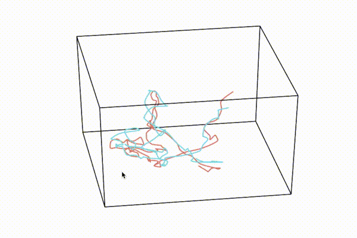
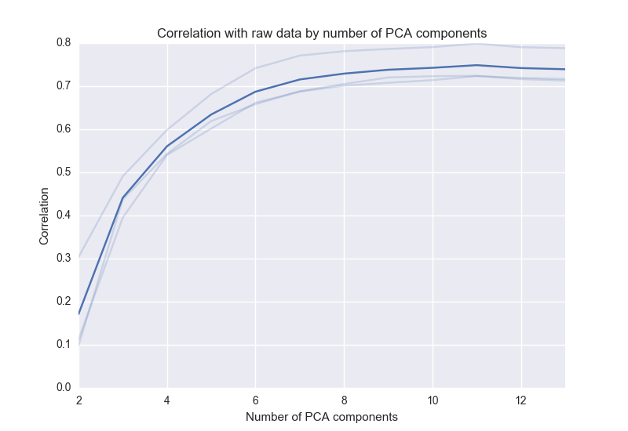

<h1>Hypertools - A python package for visualizing high dimensional data</h1>


<h2>Install</h2>

To install from this repo, navigate to this folder in Terminal and type:

pip install -e .

(this assumes you have pip installed on your system: https://pip.pypa.io/en/stable/installing/)

Coming soon: `pip install hypertools`

<h2>Main function</h2>

+ <b>plot</b> - plots multidimensional data as static image or movie

<h2>Sub functions</h2>

+ <b>util.align</b> - align multidimensional data (See here for details)
+ <b>util.reduce</b> - implements PCA to reduce dimensionality of data
+ <b>util.cluster</b> - function that runs k-means clustering and returns cluster labels
+ <b>util.describe_pca</b> - plotting tool to evaluate how well the principle components describe the data
+ <b>util.missing_inds</b> - function that returns indices of missing data (nans)

<h2>Plot</h2>


<b>Inputs:</b>

A numpy array, list of arrays, or pandas dataframe

<b>Arguments:</b>

Format strings can be passed as a string, or tuple/list of length x.
See matplotlib API for more styling options

<b>Keyword arguments:</b>

<i>animate</i> (bool): If True, plots the data as an animated trajectory

<i>save_path</i> (str): Path to save the image/movie.  Must include the file extension in the save path (i.e. `save_path='/path/to/file/image.png'`).  NOTE: If saving an animation, FFMPEG must be installed (this is a matplotlib req). FFMPEG can be easily installed on a mac via homebrew `brew install ffmpeg` or linux via apt-get `apt-get install ffmpeg`.  If you don't have homebrew (mac only), you can install it like this: `/usr/bin/ruby -e "$(curl -fsSL https://raw.githubusercontent.com/Homebrew/install/master/install)"`.

<i>palette</i> (str): A matplotlib or seaborn color palette

<i>color</i> (list): A list of colors for each line to be plotted. Can be named colors, RGB values (e.g. (.3, .4, .1)) or hex codes. If defined, overrides palette. See http://matplotlib.org/examples/color/named_colors.html for list of named colors. Note: must be the same length as X.

<i>point_colors</i> (list of str, floats or ints): A list of colors for each point. Must be dimensionality of data (X). If the data type is numerical, the values will be mapped to rgb values in the specified palette.  If the data type is strings, the points will be labeled categorically.

<i>linestyle</i> (list): a list of line styles

<i>marker</i> (list): a list of marker types

<i>ndims</i> (int): an int representing the number of dims to plot in. Must be 1,2, or 3.  NOTE: Currently only works with static plots.

<i>legend</i> (list): A list of string labels to be plotted in a legend (one for each list item)

<i>labels</i> (list): A list of labels for each point. Must be dimensionality of data (X). If no label is wanted for a particular point, input `None`

<i>n_clusters</i> (int): If n_clusters is passed, hypertools will perform k-means clustering with the k parameter set to n_clusters. The resulting clusters will be plotted in different colors according to the color palette.

<i>explore</i> (bool): Displays user defined labels will appear on hover. If no labels are passed, The point index and coordinate will be plotted. To use, set `explore=True`.

<h3>Example uses</h3>

Import the library: `import hypertools as hyp`

Plot with default color palette: `hyp.plot(data)`

Plot as movie: `hyp.plot(data, animate=True)`

Change color palette: `hyp.plot(data,palette='Reds')`

Specify colors using unlabeled list of format strings: `hyp.plot([data[0],data[1]],['r:','b--'])`

Plot data as points: `hyp.plot([data[0],data[1]],'o')`

Specify colors using keyword list of colors (color codes, rgb values, hex codes or a mix): `hyp.plot([data[0],data[1],[data[2]],color=['r', (.5,.2,.9), '#101010'])`

Specify linestyles using keyword list: `hyp.plot([data[0],data[1],[data[2]],linestyle=[':','--','-'])`

Specify markers using keyword list: `hyp.plot([data[0],data[1],[data[2]],marker=['o','*','^'])`

Specify markers with format string and colors with keyword argument: `hyp.plot([data[0],data[1],[data[2]], 'o', color=['r','g','b'])`

Specify labels:
```
# Label first point of each list
labels=[]
for idx,i in enumerate(data):
    tmp=[]
    for iidx,ii in enumerate(i):
        if iidx==0:
            tmp.append('Point ' + str(idx))
        else:
            tmp.append(None)
    labels.append(tmp)

hyp.plot(data, 'o', labels=labels)
```

Specify point_colors:
```
# Label first point of each list
point_colors=[]
for idx,i in enumerate(data):
    tmp=[]
    for iidx,ii in enumerate(i):
            tmp.append(np.random.rand())
    point_colors.append(tmp)

hyp.plot(data, 'o', point_colors=point_colors)
```

Plot in 2d: `hyp.plot(data, ndims=2)`

Group clusters by color: `hyp.plot(data, n_clusters=10)`

Create a legend: `hyp.plot([data[0],data[1]], legend=['Group A', 'Group B'])`

Turn on explore mode (experimental): `hyp.plot(data, 'o', explore=True)`

<h2>Align</h2>

<h3><center>BEFORE</center></h3>


<h3><center>AFTER</center></h3>



<b>Inputs:</b>

A list of numpy arrays

<b>Outputs</b>

An aligned list of numpy arrays

<h3>Example uses</h3>

align a list of arrays: `aligned_data = hyp.util.align(data)`

<h2>Reduce</h2>

<b>Inputs:</b>

A numpy array or list of numpy arrays

<b>Keyword arguments:</b>

ndims - dimensionality of output data

<b>Outputs</b>

An array or list of arrays with reduced dimensionality

<h3>Example uses</h3>

Reduce n-dimensional array to 3d: `reduced_data = hyp.util.reduce(data, ndims=3)`

<h2>Cluster</h2>

<b>Inputs:</b>

A numpy array or list of numpy arrays

<b>Keyword arguments:</b>

+ n_clusters (int) - number of clusters to fit (default=8)
+ ndims (int) - reduce data to ndims before running k-means (optional)

<b>Outputs</b>

A list of cluster labels corresponding to each data point.  NOTE: During the cluster fitting, the data are stacked across lists, so if multiple lists are passed, the returned list of cluster labels will need to be reshaped.

<h3>Example use:</h3>

```
cluster_labels = hyp.util.cluster(data, n_clusters=10)
hyp.plot(data, 'o', point_colors = cluster_labels)
```


<h2>Describe PCA</h2>

<b>Inputs:</b>

A numpy array or list of numpy arrays

<b>Outputs</b>

A plot summarizing the correlation between raw input data and PCA reduced data

<h3>Example uses</h3>

`hyp.util.describe_pca(data)`


